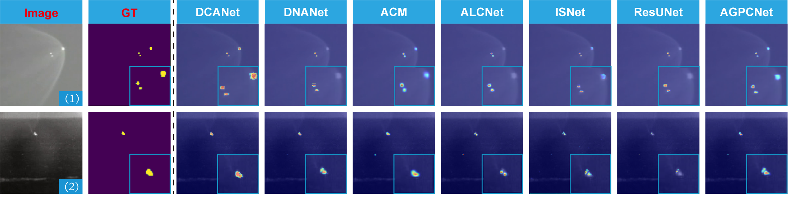
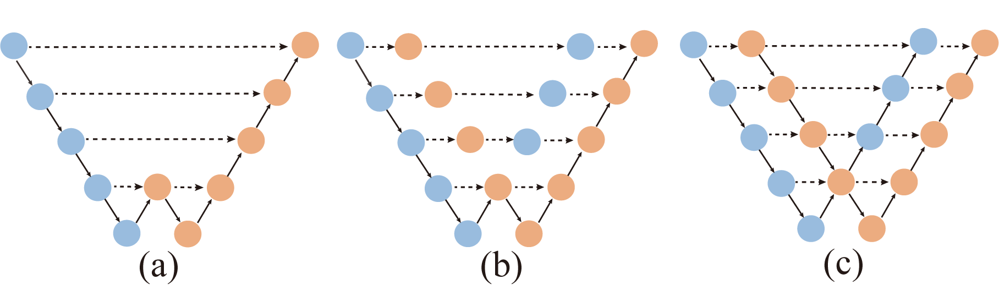
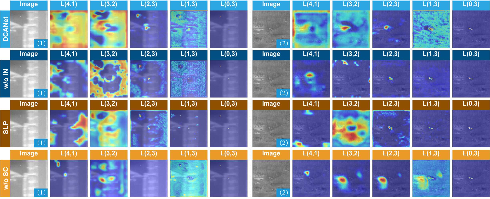
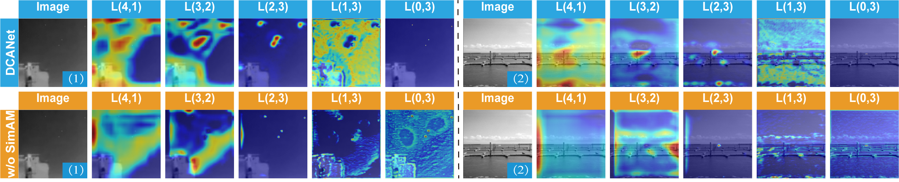
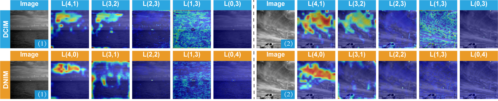

# DCANet: Dense Convolutional Attention Network for Infrared Small Target Detection


## Algorithm Introduction

We propose a dense convolutional attention network (DCANet) to achieve accurate single-frame infrared small target detection in this paper. Experiments on both public (e.g., NUAA-SIRST, NUST-SIRST) demonstrate the effectiveness of our method. The contribution of this paper are as follows:

1. We propose a dense convolutional attention network (DCANet) to maintain small targets in deep layers.

2. Performing well on all existing SIRST datasets.


## Prerequisite
* Tested on Ubuntu 18.04, with Python 3.8, PyTorch 1.8.1, Torchvision 0.9.1, CUDA 11.7, and 1x NVIDIA 1080Ti and also 

* Tested on Windows 10  , with Python 3.9, PyTorch 2.2.2, Torchvision 0.17.2, CUDA 12.0, and 1x NVIDIA 1080Ti.

* **NUDT-SIRST** &nbsp; [[download]](https://github.com/YeRen123455/Infrared-Small-Target-Detection) &nbsp; [[paper]](https://ieeexplore.ieee.org/abstract/document/9864119)

* **NUAA-SIRST** &nbsp; [[download]](https://github.com/YimianDai/sirst) &nbsp; [[paper]](https://arxiv.org/pdf/2009.14530.pdf)

* **IRSTD-1K** &nbsp; [[download]](https://github.com/RuiZhang97/ISNet) &nbsp; [[paper]](https://ieeexplore.ieee.org/document/9880295)

* **ISTDD** &nbsp;  download from [Google Drive](https://drive.google.com/file/d/13hhEwYHU19oxanXYf-wUpZ7JtiwY8LuT/view?usp=sharing) or [BaiduYun Drive](https://pan.baidu.com/s/1c35pADjPhkAcLwmU-u0RBA) with code `ojd4`.


## 🔥 Model Zoo

| **Model**  | **chekcpoint**  **(NUDT-SIRST)**   | **chekcpoint**  **(NUAA-SIRST)** |**chekcpoint** **(IRSTD-1K)** |**chekcpoint** **(ISTDD)** |**status** |
|------------|------------------------------------|------------------------------------|------------------------------------|------------------------------------|-------------|
| **ACM**  | [GoogleDrive](https://drive.google.com/file/d/1O2-m3WysVbFH9OgRVCXBAjIjeVhriApQ/view?usp=drive_link)    | [GoogleDrive](https://drive.google.com/file/d/1u_wXLIf1Nvn5cuwyQ0hmksO_t7KTgnkw/view?usp=drive_link) | [GoogleDrive](https://drive.google.com/file/d/10azZI5GZv60tHxOyGWD6nbE2AnvD1kVn/view?usp=drive_link)| [GoogleDrive](https://drive.google.com/file/d/1dTLjaRjuKAgweqSqTHXQVWlV8cniPhfL/view?usp=drive_link) | Released |
| **ALCNet**  | [GoogleDrive](https://drive.google.com/file/d/1MXnVj2mBs-StBg6IhCwXPFE7W-Y0y_b7/view?usp=drive_link) | [GoogleDrive](https://drive.google.com/file/d/1D3eGs0PsMem51DKznj4oMOnpzHc0CO8Y/view?usp=drive_link) | [GoogleDrive](https://drive.google.com/file/d/1MDln9MDtN1d9jlEkR-Gbn5gCs3xIDd3S/view?usp=drive_link)| [GoogleDrive](https://drive.google.com/file/d/1JwEYFTlrugEGdpBesSRUXgUY0cBSgMXS/view?usp=drive_link) | Released |
| **ResUNet** | [GoogleDrive](https://drive.google.com/file/d/1GjJKx34W1oh_m0TLfS-upIqhkJzGHL7O/view?usp=drive_link) | [GoogleDrive](https://drive.google.com/file/d/1GxhoCLL3hd5uCK5EL_J8kmUW11T7nFMr/view?usp=drive_link) | [GoogleDrive](https://drive.google.com/file/d/1SRmC1ldcUzmTqvzDDwQuzSk9KlKlRZvI/view?usp=drive_link)| [GoogleDrive](https://drive.google.com/file/d/1-WDS-tNB1Ghym0LJ46ss4c8lgKZTLgrP/view?usp=drive_link) | Released |
| **ISNet** | [GoogleDrive](https://drive.google.com/file/d/1ZY9OBpKmRki6d-8gzMKwVMxa25KxHeEl/view?usp=drive_link)   | [GoogleDrive](https://drive.google.com/file/d/1eOF9KDAdsDrWHWYuq-9aso6PIx_a1XMS/view?usp=drive_link) | [GoogleDrive](https://drive.google.com/file/d/1tfWVmPPFgy36sjJBDMZUyQMtSNdgq0Bm/view?usp=drive_link)| [GoogleDrive](https://drive.google.com/file/d/1oZ4UjZK9Q2-xp-96sYBizr_FAP9-smSq/view?usp=drive_link) | Released |
| **AGPCNet** | [GoogleDrive](https://drive.google.com/file/d/1_cXMLoHQECSv3XD0D_wHfI_GKClIAoN-/view?usp=drive_link) | [GoogleDrive](https://drive.google.com/file/d/1TDjsSrVGYnyC15igwmRxrF21IA0JVUFn/view?usp=drive_link) | [GoogleDrive](https://drive.google.com/file/d/1LDPKMFAZDhNy7CeFWNK1oLbQeFEnBNCU/view?usp=drive_link)| [GoogleDrive](https://drive.google.com/file/d/1TajQPwbiFX80yhHpwtRsvKg-RMi3CstT/view?usp=drive_link) | Released |
| **DNANet** | [GoogleDrive](https://drive.google.com/file/d/1W0vFhxyxQe2MYI6CaUlSEmh-rQUUkyNv/view?usp=drive_link)  | [GoogleDrive](https://drive.google.com/file/d/12XKXFEu8JUv0hMCP1hoRXmYTuJp_k1LP/view?usp=drive_link) | [GoogleDrive](https://drive.google.com/file/d/1B01QV2g6ps56iWPkJwdG2G1KhEcH_puK/view?usp=drive_link)| [GoogleDrive](https://drive.google.com/file/d/1vBpMJNsUUKeVAPveK1rEneNxoF_r-VJs/view?usp=drive_link) | Released |
| **DCANet** |[GoogleDrive](https://drive.google.com/file/d/1zzx4PaD8-4_Lh_qNhuxOTip-71_5bFxe/view?usp=drive_link)| [GoogleDrive](https://drive.google.com/file/d/1-UDc9Tb6fK17JeAEfjCwIpfJeDZPXSXQ/view?usp=drive_link)| [GoogleDrive](https://drive.google.com/file/d/1-ZDGyKg0LFlYrOmUnmRSUeheawNMp3u0/view?usp=drive_link)| [GoogleDrive](https://drive.google.com/file/d/1-zmzemVa64AvRzP8O3PtXIIXg6JXm6Vy/view?usp=drive_link)|Grad Cam| 


## 🔥🔥Ablation Study (DCIM) Model Zoo


| **Model**  | **chekcpoint**  **(NUDT-SIRST)**   | **chekcpoint**  **(NUAA-SIRST)** |**chekcpoint** **(IRSTD-1K)** |**chekcpoint** **(ISTDD)** |**status** |
|------------|------------------------------------|------------------------------------|------------------------------------|------------------------------------|-------------|
| **DCANet w/o IN**  |[GoogleDrive](https://drive.google.com/file/d/1TP0qkp7Qmd3xS7_b3IwNbVgg8P-hfWKh/view?usp=drive_link)| [GoogleDrive](https://drive.google.com/file/d/1bjraGD_KVTIe24dLn9sCjhq1wnCWfHmT/view?usp=drive_link)| [GoogleDrive](https://drive.google.com/file/d/1-G_aLub7foGMX1hzi8E3wUPPfY4uO4ky/view?usp=drive_link)| [GoogleDrive](https://drive.google.com/file/d/1-ODm_lQr1Hj13jFhw89EPOieRl-2ZNeq/view?usp=drive_link)|Grad Cam| 
| **DCANet SLP**     |[GoogleDrive](https://drive.google.com/file/d/1zC-E4nQ9PcCJb7Y9wkVwGCVkLsbju9sy/view?usp=drive_link)| [GoogleDrive]()| [GoogleDrive](https://drive.google.com/file/d/1-1_x6b2aEQM1Dq3ngS9sygI3gvKzHWal/view?usp=drive_link)| [GoogleDrive](https://drive.google.com/file/d/1-LK0XTaq-v6WTqLlVMJ-MrShpHDxx_pN/view?usp=drive_link)|Grad Cam| 
| **DCANet w/o SC**  |[GoogleDrive](https://drive.google.com/file/d/1z2emFO3b5ULqDU7DAC_-Hn8SUMZ4De-2/view?usp=drive_link)| [GoogleDrive](https://drive.google.com/file/d/1--FQuiAjl_2hURWR1tcg7G_Sc6j8z7X4/view?usp=drive_link)| [GoogleDrive](https://drive.google.com/file/d/1-5UdhZxV4kwRQ6_e_ib8nVqbTNR-MUd6/view?usp=drive_link)| [GoogleDrive](https://drive.google.com/file/d/1-NdWhV5uyTXPFSU20ghbeFk0CKvS75OE/view?usp=drive_link)|Grad Cam| 
| **DCANet**         |[GoogleDrive](https://drive.google.com/file/d/1zzx4PaD8-4_Lh_qNhuxOTip-71_5bFxe/view?usp=drive_link)| [GoogleDrive](https://drive.google.com/file/d/1-UDc9Tb6fK17JeAEfjCwIpfJeDZPXSXQ/view?usp=drive_link)| [GoogleDrive](https://drive.google.com/file/d/1-ZDGyKg0LFlYrOmUnmRSUeheawNMp3u0/view?usp=drive_link)| [GoogleDrive](https://drive.google.com/file/d/1-zmzemVa64AvRzP8O3PtXIIXg6JXm6Vy/view?usp=drive_link)|Grad Cam| 


## 🔥🔥Ablation Study (SimAM) Model Zoo

| **Model**  | **Backbone**  | **chekcpoint**  **(NUDT-SIRST)**   | **chekcpoint**  **(NUAA-SIRST)** |**chekcpoint** **(IRSTD-1K)** |**chekcpoint** **(ISTDD)** |**status** |
|------------|------------|------------------------------------|------------------------------------|------------------------------------|------------------------------------|-------------|
| **DCANet w/o SimAM** | **ResNet18**|[GoogleDrive](https://drive.google.com/file/d/1wT0Dzl9GuGRjT-864KpNkileDZnepMyk/view?usp=drive_link)| [GoogleDrive](https://drive.google.com/file/d/1-7T7R6b7BuE3sXLGak8Pbp0_MUGeogY3/view?usp=drive_link)| [GoogleDrive](https://drive.google.com/file/d/1-CNYONumA_Vdv19LSbL6QHR2Y7LJtsnt/view?usp=drive_link)| [GoogleDrive](https://drive.google.com/file/d/1-HFnGoH_HD3_v6POy4RyhAnA8ofy9knc/view?usp=drive_link)|Grad Cam| 
| **DCANet**           | **ResNet18**|[GoogleDrive](https://drive.google.com/file/d/1-vAffjw40lzsdBX_yiGZQxSZUv76pO77/view?usp=drive_link)| [GoogleDrive](https://drive.google.com/file/d/1-bleDdUwOu6QmRYcZ1bXApw_Sytxc9y0/view?usp=drive_link)| [GoogleDrive](https://drive.google.com/file/d/1-aYcZV1_whmYJokWubXy_drIjl9xblc1/view?usp=drive_link)| [GoogleDrive](https://drive.google.com/file/d/10-fowcY-CtKUYAr-nwo9pJ5QNSP_y7gv/view?usp=drive_link)|Grad Cam| 
| **DCANet w/o SimAM** | **ResNet34**|[GoogleDrive](https://drive.google.com/file/d/1dKkmP01WJb8L_4k81npCOxk8sbORnopr/view?usp=drive_link)| [GoogleDrive](https://drive.google.com/file/d/1-7bbLSPfsBIAJb0e946PcKh21cqdb3Jg/view?usp=drive_link)| [GoogleDrive](https://drive.google.com/file/d/1-Dwr1Y54TPPZnilpFBxdOSuAszUcsgMd/view?usp=drive_link)| [GoogleDrive]()|Grad Cam| 
| **DCANet**           | **ResNet34**|[GoogleDrive](https://drive.google.com/file/d/1zzx4PaD8-4_Lh_qNhuxOTip-71_5bFxe/view?usp=drive_link)| [GoogleDrive](https://drive.google.com/file/d/1-UDc9Tb6fK17JeAEfjCwIpfJeDZPXSXQ/view?usp=drive_link)| [GoogleDrive](https://drive.google.com/file/d/1-ZDGyKg0LFlYrOmUnmRSUeheawNMp3u0/view?usp=drive_link)| [GoogleDrive](https://drive.google.com/file/d/1-zmzemVa64AvRzP8O3PtXIIXg6JXm6Vy/view?usp=drive_link)|Grad Cam| 


## 🔥🔥 Compared with DCIM & DNIM Model Zoo

| **Methods**  | **Structure** | **Attention**  | **chekcpoint**  **(NUDT-SIRST)**   | **chekcpoint**  **(NUAA-SIRST)** |**chekcpoint** **(IRSTD-1K)** |**chekcpoint** **(ISTDD)** |**status** |
|------------|------------|------------|------------------------------------|------------------------------------|------------------------------------|------------------------------------|-------------|
| **DNANet**           | **DNIM**| **CSAM** |[GoogleDrive](https://drive.google.com/file/d/1l-mHVwH-iUFyYif88dC_JZl-bcTrEmwJ/view?usp=drive_link)| [GoogleDrive](https://drive.google.com/file/d/12XKXFEu8JUv0hMCP1hoRXmYTuJp_k1LP/view?usp=drive_link) | [GoogleDrive](https://drive.google.com/file/d/1B01QV2g6ps56iWPkJwdG2G1KhEcH_puK/view?usp=drive_link)| [GoogleDrive](https://drive.google.com/file/d/1vBpMJNsUUKeVAPveK1rEneNxoF_r-VJs/view?usp=drive_link) |Grad Cam| 
| **DCANet (CSAM)**    | **DCIM**| **CSAM** |[GoogleDrive](https://drive.google.com/file/d/1-5Po2t7kxNGT92I0C0HvrCshe15QGpKE/view?usp=drive_link)| [GoogleDrive](https://drive.google.com/file/d/1-7ED0K64Je8GDSAKmMEQg6L8HBcNShMF/view?usp=drive_link)| [GoogleDrive](https://drive.google.com/file/d/1-CKpxdQDe7P7RxoVx7EsAqVjg45M9hzc/view?usp=drive_link)| [GoogleDrive](https://drive.google.com/file/d/1-I4cpi7PqDc538FARZvXsNMy4clk1-IR/view?usp=drive_link)|Grad Cam| 
| **DCANet**           | **DCIM**| **SimAM**|[GoogleDrive](https://drive.google.com/file/d/1zzx4PaD8-4_Lh_qNhuxOTip-71_5bFxe/view?usp=drive_link)| [GoogleDrive](https://drive.google.com/file/d/1-UDc9Tb6fK17JeAEfjCwIpfJeDZPXSXQ/view?usp=drive_link)| [GoogleDrive](https://drive.google.com/file/d/1-ZDGyKg0LFlYrOmUnmRSUeheawNMp3u0/view?usp=drive_link)| [GoogleDrive](https://drive.google.com/file/d/1-zmzemVa64AvRzP8O3PtXIIXg6JXm6Vy/view?usp=drive_link)|Grad Cam| 

* To better visually demonstrate the role of each node in our model and the characteristics of the DCIM structure, we have trained a large number of models with all gradient values included (status set to Grad CAM). Therefore, the checkpoint of the Grad CAM version of the model is relatively large.

## Usage

#### On windows:

```
Click on train.py and run it. 
```

#### On Ubuntu:

#### 1. Train.

```bash
python train.py --base_size 256 --crop_size 256 --epochs 1500 --dataset [dataset-name] --split_method 50_50 --model [model name] --backbone Res_SimAM_block  --deep_supervision True --train_batch_size 4 --test_batch_size 4 --mode TXT

```
#### 2. Test.

```bash
python test_and_visulization.py --base_size 256 --crop_size 256 --st_model [trained model path] --model_dir [model_dir] --dataset [dataset-name] --split_method 50_50 --model [model name] --backbone Res_SimAM_block  --deep_supervision True --test_batch_size 1 --mode TXT 
```

*This code is highly borrowed from DNANet(https://github.com/YeRen123455/Infrared-Small-Target-Detection). Thanks to Boyang Li.


## Referrences

1. Dai Y, Wu Y, Zhou F, et al. Asymmetric contextual modulation for infrared small target detection[C]//Proceedings of the IEEE/CVF Winter Conference on Applications of Computer Vision. 2021: 950-959. [[code]](https://github.com/YimianDai/open-acm)

2. Y. Dai, Y. Wu, F. Zhou, K. Barnard, Attentional local contrast networks for infrared small target detection, IEEE Transactions on Geoscience and Remote Sensing 59 (11) (2021) 9813–9824.

3. M. Zhang, R. Zhang, Y. Yang, H. Bai, J. Zhang, J. Guo, Isnet: Shape matters for infrared small target detection, in: 2022 IEEE/CVF Conference on Computer Vision and Pattern Recognition (CVPR), IEEE, 2022.

4. F. I. Diakogiannis, F. Waldner, P. Caccetta, C. Wu, ResUNet-a: A deep learning framework for semantic segmentation of remotely sensed data, ISPRS Journal of Photogrammetry and Remote Sensing 162 (2020) 94–114.

5. T. Zhang, L. Li, S. Cao, T. Pu, Z. Peng, Attention-guided pyramid context networks for detecting infrared small target under complex background, IEEE Transactions on Aerospace and Electronic Systems 59 (4) (2023) 42504261.

6. B. Li, C. Xiao, L. Wang, Y. Wang, Z. Lin, M. Li, W. An, Y. Guo, Dense nested attention network for infrared small target detection, IEEE Transactions on Image Processing 32 (2023) 1745-1758.[[code]](https://github.com/YeRen123455/Infrared-Small-Target-Detection) 