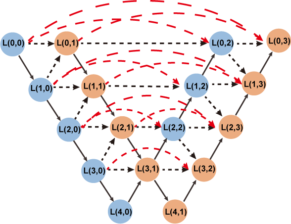

# DCANet: Dense Convolutional Attention Network for Infrared Small Target Detection


## Algorithm Introduction

We propose a dense convolutional attention network (DCANet) to achieve accurate single-frame infrared small target detection in this paper. Experiments on both public (e.g., NUAA-SIRST, NUST-SIRST) demonstrate the effectiveness of our method. The contribution of this paper are as follows:

1. We propose a dense convolutional attention network (DCANet) to maintain small targets in deep layers.

2. Performing well on all existing SIRST datasets.



## Prerequisite
* Tested on Ubuntu 18.04, with Python 3.8, PyTorch 1.8.1, Torchvision 0.9.1, CUDA 11.7, and 1x NVIDIA 1080Ti and also 

* Tested on Windows 10  , with Python 3.9, PyTorch 2.2.2, Torchvision 0.17.2, CUDA 12.0, and 1x NVIDIA 1080Ti.

* * **NUDT-SIRST** &nbsp; [[download]](https://github.com/YeRen123455/Infrared-Small-Target-Detection) &nbsp; [[paper]](https://ieeexplore.ieee.org/abstract/document/9864119)

* **NUAA-SIRST** &nbsp; [[download]](https://github.com/YimianDai/sirst) &nbsp; [[paper]](https://arxiv.org/pdf/2009.14530.pdf)

* **IRSTD-1K** &nbsp; [[download dir]](https://github.com/RuiZhang97/ISNet) &nbsp; [[paper]](https://ieeexplore.ieee.org/document/9880295)

* **ISTDD** &nbsp;  download from [Google Drive](https://drive.google.com/file/d/13hhEwYHU19oxanXYf-wUpZ7JtiwY8LuT/view?usp=sharing) or [BaiduYun Drive](https://pan.baidu.com/s/1c35pADjPhkAcLwmU-u0RBA) with code `ojd4`.
## Usage

#### On windows:

```
Click on train.py and run it. 
```

#### On Ubuntu:

#### 1. Train.

```bash
python train.py --base_size 256 --crop_size 256 --epochs 1500 --dataset [dataset-name] --split_method 50_50 --model [model name] --backbone Res_SimAM_block  --deep_supervision True --train_batch_size 4 --test_batch_size 4 --mode TXT

```
#### 2. Test.

```bash
python test_and_visulization.py --base_size 256 --crop_size 256 --st_model [trained model path] --model_dir [model_dir] --dataset [dataset-name] --split_method 50_50 --model [model name] --backbone Res_SimAM_block  --deep_supervision True --test_batch_size 1 --mode TXT 
```

*This code is highly borrowed from DNANet(https://github.com/YeRen123455/Infrared-Small-Target-Detection). Thanks to Boyang Li.


## Referrences

1. B. Li, C. Xiao, L. Wang, Y. Wang, Z. Lin, M. Li, W. An, Y. Guo, Dense nested attention network for infrared small target detection, IEEE Transactions on Image Processing 32 (2023) 1745-1758.[[code]](https://github.com/YeRen123455/Infrared-Small-Target-Detection) 


